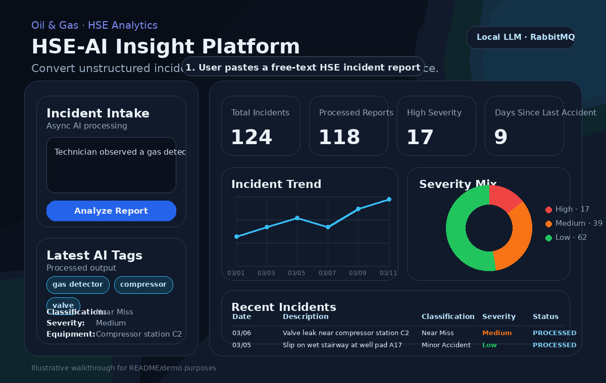

# HSE-AI Insight Platform

HSE-AI Insight Platform is a full-stack Oil & Gas safety analytics application that converts free-text HSE incident reports into structured data and actionable insights. The platform uses a local open-source LLM served by Ollama to extract entities, classify events, infer severity, and feed a dark-themed operational dashboard for proactive risk management.

## Product walkthrough

The repository includes an **illustrative demo GIF** so a non-technical user can quickly understand the product flow.



What the walkthrough shows:

1. A user pastes a free-text HSE incident report.
2. The frontend submits the report to the NestJS API.
3. The API queues the job in RabbitMQ for asynchronous processing.
4. The worker uses Ollama + Qwen2 to extract entities and classify severity.
5. The dashboard refreshes with KPIs, tags, and recent incident records.

> Note: this GIF is a visual product walkthrough included for documentation and portfolio purposes. It is not a runtime screen recording.

## Why this project exists

HSE data in Oil & Gas environments is often captured as unstructured text. Valuable signals about unsafe conditions, recurring root causes, and injury patterns stay buried in narrative reports. This project turns those narratives into searchable, analyzable, and operationally useful data.

## Core capabilities

- Submit free-text incident reports from the UI.
- Process reports asynchronously through RabbitMQ.
- Use Ollama + Qwen2 for structured AI extraction.
- Persist original and normalized incident data in PostgreSQL.
- Index reports in OpenSearch for text search and analytics.
- Display KPIs, trends, recent incidents, and extracted tags in a modern dashboard.
- Run the full development stack locally with Docker Compose.

## Architecture

```text
Next.js SPA
   |
   v
NestJS API ---> RabbitMQ ---> Worker ---> Ollama (Qwen2)
   |                               |            |
   |                               v            |
   +--------------------------> PostgreSQL <----+
                                   |
                                   v
                              OpenSearch
```

## Tech stack

- **Frontend:** Next.js + React + TypeScript
- **Backend API:** NestJS + TypeScript
- **Worker:** Node.js + TypeScript
- **Database:** PostgreSQL
- **Message broker:** RabbitMQ
- **Search engine:** OpenSearch
- **LLM runtime:** Ollama with `qwen2:7b`
- **Container orchestration:** Docker Compose

## Monorepo structure

```text
hse-ai-insight-platform/
├── apps/
│   ├── backend/
│   ├── frontend/
│   └── worker/
├── infrastructure/
│   └── postgres/
├── docker-compose.yml
├── .env.example
├── Makefile
└── README.md
```

## User workflow

1. An operator pastes a free-text HSE report into the left control panel.
2. The frontend sends the payload to the NestJS ingestion endpoint.
3. The API stores the report with status `QUEUED` and publishes a message to RabbitMQ.
4. The worker consumes the message and calls Ollama with a structured extraction prompt.
5. The worker updates PostgreSQL with classification, severity, tags, summary, and entities.
6. The worker indexes the enriched document into OpenSearch.
7. The dashboard refreshes and shows updated KPIs, recent incidents, trends, and extracted tags.

## Quick start

### 1. Copy environment variables

```bash
cp .env.example .env
```

### 2. Start the stack

```bash
docker compose up --build -d
```

### 3. Pull the LLM model inside Ollama

```bash
docker compose exec ollama ollama pull qwen2:7b
```

### 4. Open the apps

- Frontend: `http://localhost:3000`
- Backend API: `http://localhost:3001`
- RabbitMQ Management: `http://localhost:15672`
- OpenSearch: `http://localhost:9200`
- OpenSearch Dashboards: `http://localhost:5601`
- Ollama API: `http://localhost:11434`

Default RabbitMQ credentials:

- Username: `guest`
- Password: `guest`

## Demo mode and fallback behavior

For local demos, `AI_FALLBACK_ENABLED=true` is enabled by default. If Ollama is running but the model is not yet available, or if the LLM response is invalid, the worker falls back to a deterministic rules-based extractor so the platform still behaves end-to-end.

To force only LLM-based processing, set:

```env
AI_FALLBACK_ENABLED=false
```

## API endpoints

### Submit a report

```http
POST /api/reports
Content-Type: application/json

{
  "reportText": "Worker observed gas detector alarm near compressor station C2 after valve inspection. No injury, area isolated, likely loose fitting."
}
```

### Fetch dashboard summary

```http
GET /api/dashboard/summary
```

### Fetch trends

```http
GET /api/dashboard/trends?days=14
```

### Fetch recent incidents

```http
GET /api/reports/recent?limit=10
```

### Fetch one incident

```http
GET /api/reports/:id
```

## Sample AI schema

The worker asks the model to produce JSON with fields similar to these:

```json
{
  "classification": "Near Miss",
  "severity": "Medium",
  "equipment": "Mud pump skid",
  "location": "Well pad A17",
  "injuryType": "Minor wrist pain",
  "probableRootCause": "Poor housekeeping / slippery surface",
  "summary": "Short operational summary",
  "tags": ["slip", "maintenance", "housekeeping"]
}
```

## Frontend design notes

The UI is implemented as a dark-mode single-page dashboard with two main areas:

- **Left panel:** free-text input, analyze button, latest extracted tags.
- **Right panel:** KPI cards, line chart for incident trend, severity distribution, and recent incident table.

## Local development without Docker

Each app can also run independently:

```bash
cd apps/backend && npm install && npm run start:dev
cd apps/worker && npm install && npm run dev
cd apps/frontend && npm install && npm run dev
```

You still need PostgreSQL, RabbitMQ, OpenSearch, and Ollama available locally.

## Suggested next steps

- Add authentication and role-based access control.
- Add report attachments and image support.
- Add vector search for semantically similar incidents.
- Add WebSocket or Server-Sent Events for real-time UI updates.
- Add Prometheus and Grafana for observability.
- Add incident recommendation workflows and corrective action tracking.

## Notes on compatibility

This project uses a stack aligned with the current official documentation for NestJS, Next.js App Router, OpenSearch local Docker deployments, and the Ollama local generation API with `qwen2:7b`.

## License

MIT
